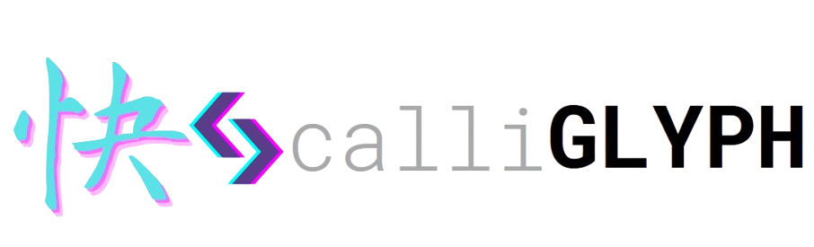

<h1 align="center"></h1>

<p align="center">
  <a href="https://github.com/VBPedersen/calli-glyph/actions"></a>
  <a href="https://github.com/VBPedersen/calli-glyph/blob/main/LICENSE"></a>
  <a href="https://github.com/VBPedersen/calli-glyph/issues"></a>
  <a href="https://blazingly.fast"> </a>
  <a href="https://github.com/VBPedersen/calli-glyph/stargazers"></a>
</p>
<p align="center">A lightweight terminal text editor built in Rust — minimal, fast, and designed for clarity.</p>

---

## ✨ Overview

**calli-glyph** (from *calligraphy* + *glyph*) is a simple, minimalistic **terminal-based text editor** written in **Rust**.  
It focuses on:
- **Speed** — small binary, instant startup.
- **Simplicity** — clean TUI, minimal dependencies.
- **Portability** — works across Unix-like systems.

---

## ⚙️ Features

- 🧱 Built entirely in **Rust**
- 🖥️ Text-mode (TUI) interface
- 💾 Open, edit, and save files
- ⚡ Fast startup & responsive editing
- 🧪 Tested with example files (`tests/` folder)
- 📜 Licensed under the [MIT License](LICENSE)

---

## 🚀 Getting Started

### Prerequisites
- [Rust toolchain](https://rustup.rs)
- A terminal environment (Linux, macOS, or Windows with WSL or compatible emulator)

### Installation

Clone the repository:
```bash
git clone https://github.com/VBPedersen/calli-glyph.git
cd calli-glyph
```
Build and run
```bash
cargo build --release
./target/release/calli-glyph <filename>
```
I suggest adding the application to ones PATH to run simplify running


### 🧭 Usage

Start the editor with a file:
```bash
calli-glyph notes.txt
```

Furter information can be found with running help command
```bash
calli-glyph -h
```

🗂️Project layout
--------------
    calli-glyph/
    ├── Cargo.toml          # Project manifest
    ├── src/                # Source code
    ├── tests/              # Tests
    ├── LICENSE
    └── README.md
-------

## 🧩 Roadmap

Planned improvements and future goals for **calli-glyph**:

- 🖍️ **Syntax Highlighting** — Add syntax coloring for popular languages such as Rust, Markdown, and JSON.  
- [✅]🔄 **Undo / Redo Support** — Implement a simple history mechanism for editing operations.  
- [✅]🔍 **Search & Replace** — Allow users to find and replace text efficiently within the buffer.  
- [✅]🎹 **Customizable Key Bindings** — Enable user-defined shortcuts through a config file.  
- 🪟 **Cross-Platform Support** — Improve compatibility across Linux, macOS, and Windows terminals.  
- 🧩 **Plugin System** *(exploratory)* — Experiment with lightweight plugin or scripting capabilities for advanced users.  
- 📦 **Crates.io Release** — Package and release the editor as a Rust crate with documentation on [docs.rs](https://docs.rs/).  
- 🧪 **Better Test Coverage** — Expand automated tests for file operations and TUI rendering.

See [open issues](https://github.com/VBPedersen/calli-glyph/issues) and [discussions](https://github.com/VBPedersen/calli-glyph/discussions) and [kanban board](https://trello.com/b/Y0kCkQBs/calli-glyph) for community ideas, milestones, and progress updates.


## License

Copyright (c) Victor B. Pedersen <vpede23@sdu.student.dk>

This project is licensed under the MIT license ([LICENSE] or <http://opensource.org/licenses/MIT>)

[LICENSE]: ./LICENSE
